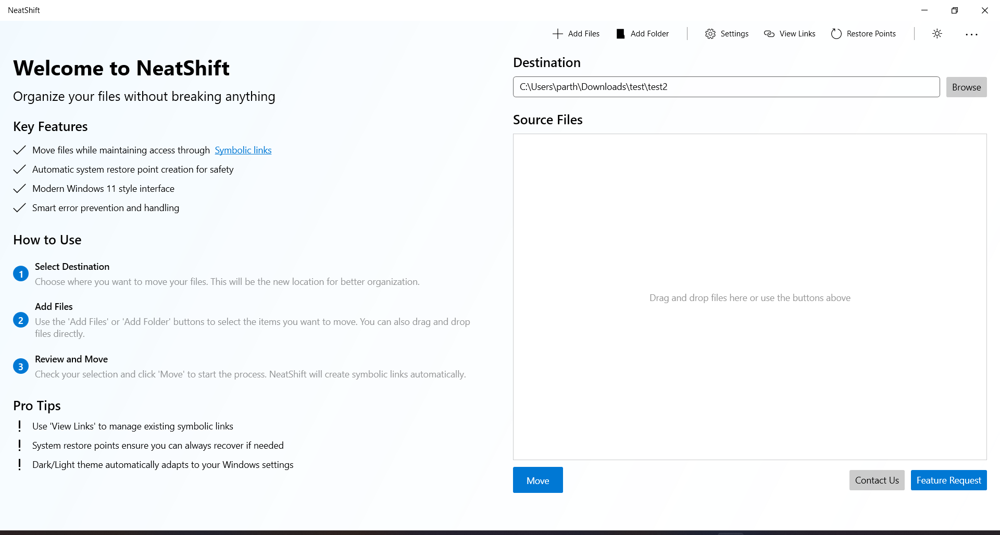
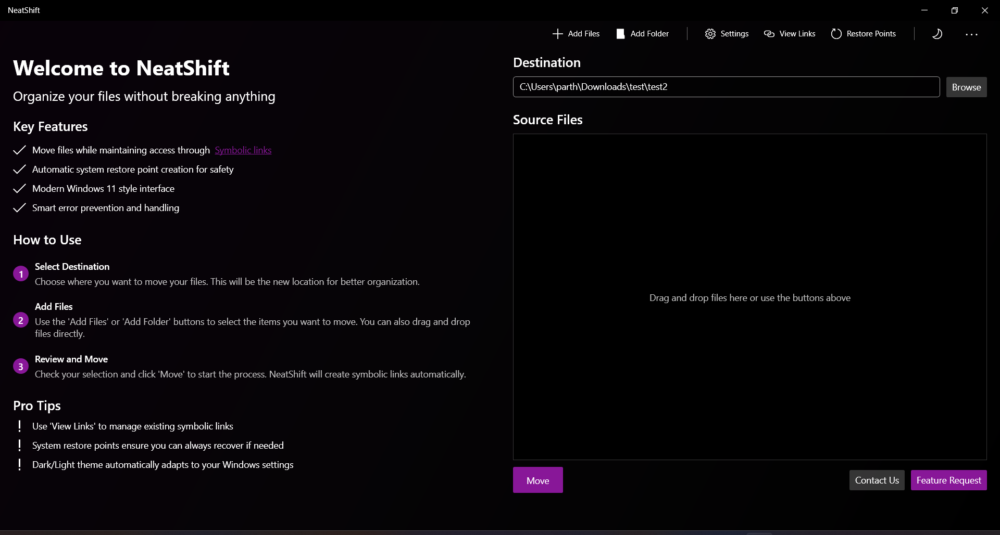

# NeatShift

Organize your files without breaking anything. NeatShift is a modern Windows application that helps you organize files and folders while maintaining their accessibility through symbolic links.

## Screenshots

### Light Mode


### Dark Mode


## Features

- 🔗 **Smart File Movement**: Move files while maintaining access through symbolic links
- 🛡️ **Safe Operations**: Automatic system restore point creation for safety
- 🎨 **Modern UI**: Clean Windows 11 style interface with dark/light theme support
- ⚡ **Drag and Drop**: Easy file and folder selection
- 🔍 **Link Management**: View and manage existing symbolic links
- ⚠️ **Error Prevention**: Smart validation and error handling

## Installation

### For Users
1. Download the latest release from the [Releases](https://github.com/BytexGrid/NeatShift/releases) page
2. Choose either:
   - `NeatShift.exe` (single file, larger size)
   - `NeatShift-Release.zip` (compressed package)
3. Run `NeatShift.exe`
   - No installation needed
   - No .NET runtime required (included in the package)

### For Developers
1. Clone the repository:
   ```
   git clone https://github.com/BytexGrid/NeatShift.git
   ```
2. Open `NeatShift.sln` in Visual Studio 2022
3. Required tools:
   - Visual Studio 2022 (any edition)
   - .NET 6.0 SDK
   - Windows SDK 10.0.19041.0 or later
4. Build and run:
   - Set `NeatShift` as startup project
   - Build solution (F6)
   - Run with debugging (F5)

## System Requirements

### Minimum Requirements
- Windows 7 SP1 or later
- Administrator privileges
- 100 MB free disk space

### Recommended
- Windows 10/11
- SSD for faster file operations
- System Restore enabled (for safety features)

## Administrator Privileges

NeatShift requires administrator privileges for two essential functions:

1. **Creating Symbolic Links**: Windows security model requires elevated privileges to create symbolic links. This is a system-level security requirement to prevent potential misuse of links.

2. **System Restore Points**: Creating system restore points requires access to system protection settings, which is only available with administrator rights.

## ⚠️ Important Disclaimer

NeatShift is currently in testing phase. While we implement safety measures like automatic system restore points, please note:

1. **Manual Backups**: We strongly recommend creating manual system restore points or file backups before using the application
2. **Testing Phase**: The application is under active development and testing
3. **No Warranty**: The software is provided "as is", without warranty of any kind
4. **User Responsibility**: Always verify symbolic links are working as expected after moving files

## How to Use

1. **Select Destination**: Choose where you want to move your files
2. **Add Files**: Use the buttons or drag and drop files/folders
3. **Move**: Click the Move button to relocate files and create symbolic links

## Support

Need help or want to request a feature?
- Join our [Discord](https://discord.gg/tc3AjBRQq9)
- Contact us on [Telegram](https://t.me/NeatShift)

## License

This software is proprietary and confidential. Unauthorized reproduction, distribution, or modification is prohibited. See the [LICENSE](LICENSE) file for details. 