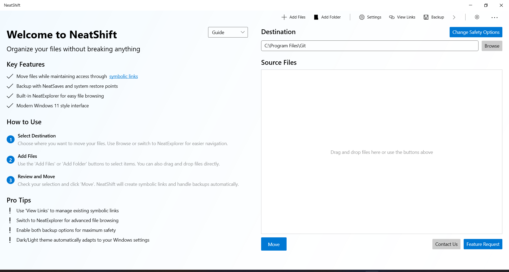
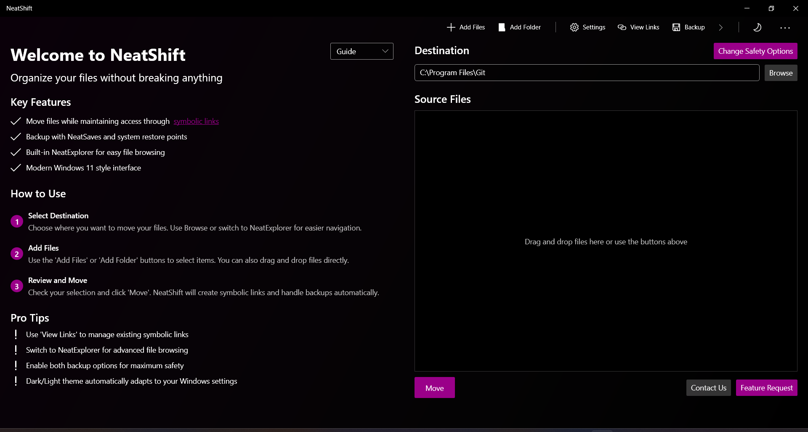
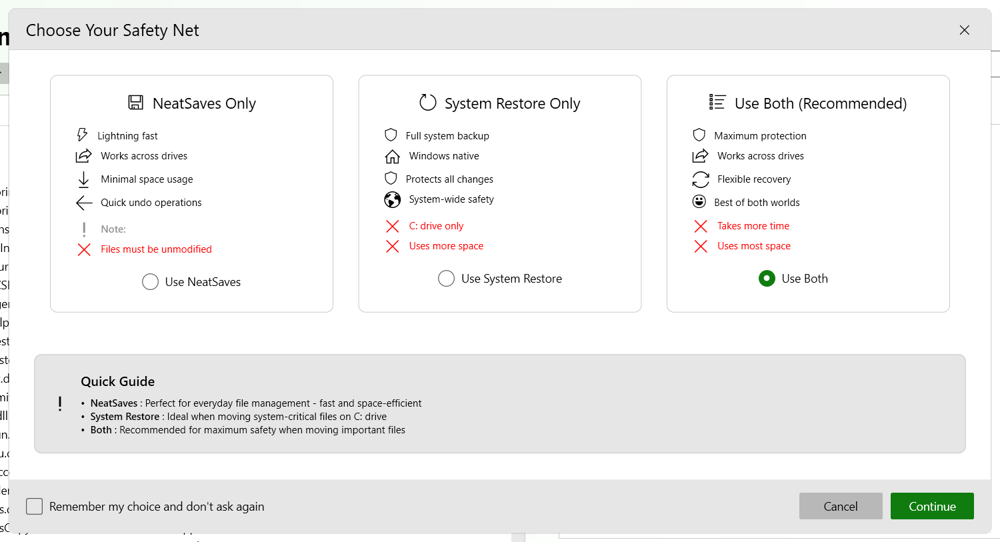
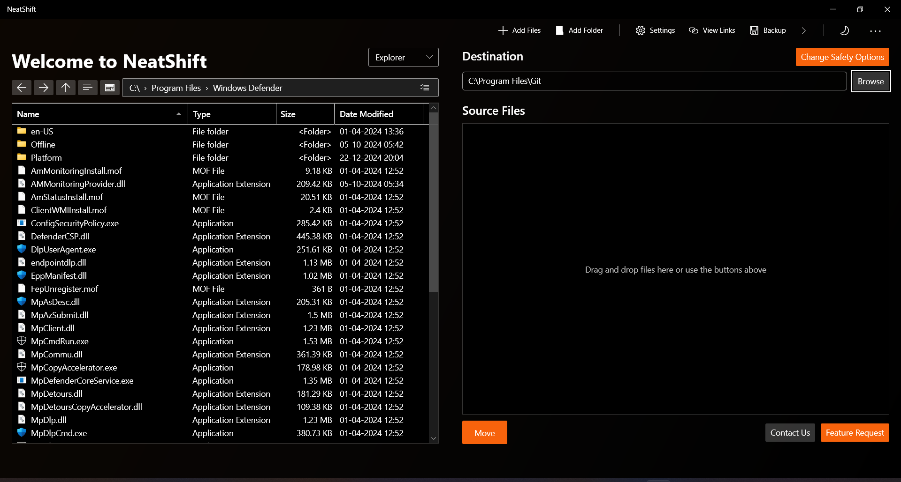

<div align="center">
  
  <h1>NeatShift</h1>
  <p>Relocate files and folders without breaking application paths.</p>
</div>

<p align="center">
  <a href="https://github.com/BytexGrid/NeatShift/wiki">📚 Learn More</a> •
  <a href="https://apps.microsoft.com/store/detail/9NHF5VVHDCGZ">🏪 Microsoft Store</a> •
  <a href="https://github.com/BytexGrid/NeatShift/releases">📦 Download</a> •
  <a href="https://github.com/BytexGrid/NeatShift/issues">🐛 Report a Bug</a> •
  <a href="https://github.com/BytexGrid/NeatShift/issues">💡 Request a Feature</a>
</p>

<div align="center">


<h2> Available on Microsoft Store</h2>

<a href="https://apps.microsoft.com/store/detail/9NHF5VVHDCGZ?cid=DevShareMCLPCB">
  
</a>

<table>
<tr>
<td align="center"><b>Microsoft Store Version</b><br>- One-click install<br>- Auto-updates<br>- Optional telemetry</td>
<td align="center"><b>GitHub Release</b><br>- Open source<br>- No telemetry<br>- Manual install</td>
</tr>
</table>

</div>

NeatShift is a Windows utility designed to solve a common problem: moving large applications, games, or folders to a different drive without breaking the shortcuts and application paths that depend on them.

When a program is installed, its location is registered with the operating system. Simply moving the folder to a new drive will cause the program to stop working. NeatShift provides a robust solution by relocating the folder and then creating a **Symbolic Link** in its original place. This link is a powerful type of shortcut that is transparent to the operating system, redirecting any request from the old path to the new location seamlessly.

### Common Use Cases:
*   **Free Up SSD Space:** Move large game installations (e.g., from Steam or Epic Games) from a primary solid-state drive to a larger hard drive without needing to reinstall them.
*   **Centralize Data:** Consolidate project files, documents, or media libraries onto a network-attached storage (NAS) or secondary drive while maintaining their original, accessible paths.
*   **System Organization:** Reorganize the directory structure of a development environment or user profile without disrupting dependencies or breaking build scripts.

NeatShift automates the process of moving data and creating these links through a clean, modern interface, with built-in safety features like System Restore point creation.

##  See It In Action

### Light Mode - Clean & Crisp


### Dark Mode - Easy on the Eyes


### User Interface Highlights

#### Safety Net Options

Choose between NeatSaves, System Restore, or both for maximum protection when moving files.

#### Integrated File Explorer

Modern file explorer interface with drag-and-drop support and intuitive file management.

##  What Makes NeatShift Special?

*  **Smart Moving**: Move files anywhere, and NeatShift creates symbolic links so everything still works
*  **Double Safety**: Choose between NeatSaves quick backup or system restore points - or use both!
*  **Looks Good, Feels Good**: Modern Windows 11 style with both light and dark themes
*  **Super Simple**: Just drag and drop your files - it's that easy
*  **Stay in Control**: See and manage all your symbolic links in one place
*  **Two Ways to Browse**: Simple guide view for beginners, pro explorer view when you need it
*  **Always Updated**: Get notified when new versions drop, update right from the app
*  **No Surprises**: Smart checks to prevent accidents before they happen

##  Getting Started

### Just Want to Use It?
1. Grab the latest version from our [Releases page](https://github.com/BytexGrid/NeatShift/releases)
2. Pick your flavor:
   * `NeatShift.exe` - One file, ready to go (bit larger)
   * `NeatShift-Release.zip` - Zipped package (smaller download)
3. Double-click and you're set!
   * No installer headaches
   * Everything's included - even the .NET stuff

### Want to Tinker With the Code?

1. Get your copy:
```bash
git clone https://github.com/BytexGrid/NeatShift.git
```
2. Fire up Visual Studio 2022
3. You'll need:
   * Visual Studio 2022 (any flavor works)
   * .NET 8.0 SDK
   * Windows SDK 10.0.19041.0+
4. Ready to roll:
   * Set `NeatShift` as your startup
   * Hit F6 to build
   * F5 to see it in action

## 📚 Learn More

Check out our [Wiki](https://github.com/BytexGrid/NeatShift/wiki) for all the details:
- [Getting Started Guide](https://github.com/BytexGrid/NeatShift/wiki/Installation)
- [How to Use](https://github.com/BytexGrid/NeatShift/wiki/Usage-Guide)
- [Safety First](https://github.com/BytexGrid/NeatShift/wiki/Security-and-Verification)
- [Common Questions](https://github.com/BytexGrid/NeatShift/wiki/FAQ)

##  What You'll Need

### Bare Minimum:
* Windows 10 version 1809 (build 17763)
* Admin rights (for creating links)
* 100 MB of space

### For the Best Experience:
* Windows 11
* An SSD (because faster is better)
* System Restore turned on (just in case)

##  About Those Admin Rights

NeatShift needs admin privileges for two things:

1. **Making Symbolic Links**: Windows is picky about who gets to create these
2. **System Restore Points**: Better safe than sorry!

## ⚠️ Heads Up!

NeatShift is still young and growing. While I've added safety nets like automatic restore points:

1. **Back Up**: Maybe create a restore point yourself - just to be extra safe
2. **Work in Progress**: We're actively improving things
3. **No Guarantees**: It works on my machine(s), but you know how that goes
4. **Double-Check**: Always verify your links work as expected

## 🤝 Need a Hand?

Got questions or ideas?

* Browse our [Wiki](https://github.com/BytexGrid/NeatShift/wiki)
* [Open an Issue](https://github.com/BytexGrid/NeatShift/issues) - I read them all!

##  Legal Stuff

NeatShift is free software under the GNU General Public License v3.0. In simple terms:
- Use it however you like
- Share it with others
- Make it better
- Share your improvements

[Full license details here](https://www.gnu.org/licenses/) 
